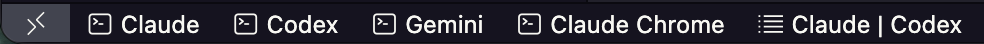
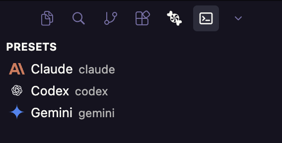
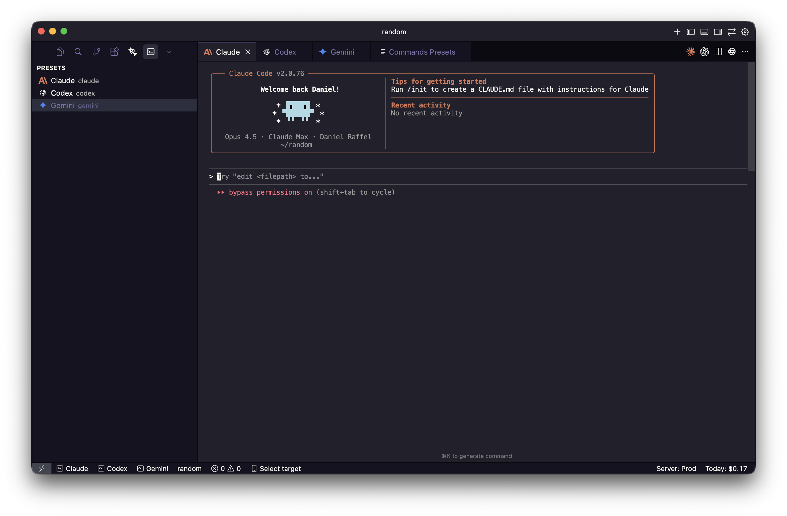
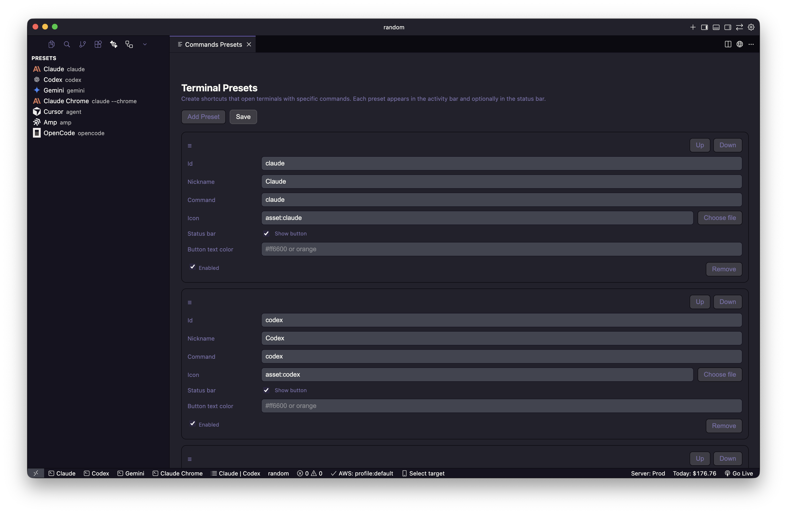
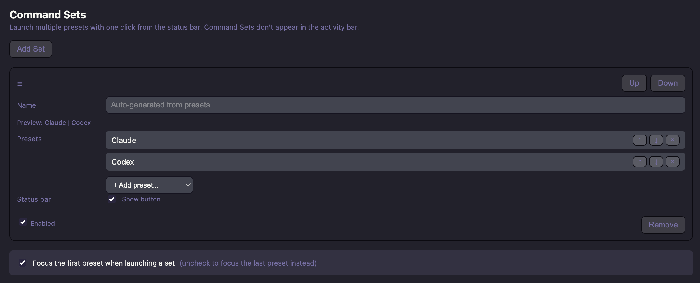

# Commands

Commands is a VS Code extension that opens terminals in the editor area with commands of your choice. This makes your terminal a first-class citizen next to your files, not tucked away in the panel or sidebar.

## What it does

- Launches terminals in the editor area and runs preset commands immediately
- Shows quick-launch buttons in the status bar for your most-used commands
- Supports **Command Sets** to open multiple terminals with one click
- Ships with presets for popular coding CLIs: Claude, Codex, Gemini, Claude Chrome, Cursor, Amp, OpenCode, and Copilot
- Lets you customize everything: presets, icons, status bar visibility, and button colors

## Default Setup

Out of the box, Commands shows these buttons in your status bar:



- **Claude** - launches Claude Code CLI
- **Codex** - launches OpenAI Codex CLI
- **Gemini** - launches Google Gemini CLI
- **Claude Chrome** - launches Claude with Chrome browser integration
- **Claude | Codex** - a Command Set that opens both Claude and Codex terminals side by side

Additional presets for Cursor, Amp, OpenCode, and Copilot are included but hidden from the status bar by default. You can enable them in the preset editor.

## Where to find it

Open the **activity bar** (the vertical strip of icons on the far left edge of the window). You'll see a Commands icon there. Click it to access your presets.



Clicking any preset opens a terminal in the editor area:



## Customizing Presets

Open the preset editor from the activity bar (gear icon) or run **Commands: Edit Presets** from the command palette.



Each preset supports:
- **Nickname** - display name shown in the activity bar and status bar
- **Command** - shell command to run when the terminal opens
- **Icon** - use `asset:name`, `codicon:name`, or choose a custom file
- **Status bar** - show/hide the quick-launch button
- **Button text color** - optional custom color for the status bar button
- **Enabled** - show/hide the preset entirely

## Command Sets

Command Sets let you launch multiple terminals with a single click. Perfect for workflows that need several tools running simultaneously.



Each Command Set includes:
- **Name** - custom name or auto-generated from selected presets (e.g., "Claude | Codex")
- **Presets** - ordered list of presets to launch
- **Status bar** - show/hide the Command Set button
- **Focus setting** - choose whether to focus the first or last terminal when launching

## Commands

- **Commands: Edit Presets** - open the visual preset editor
- **Commands: Pick Preset** - quick pick menu to launch any preset
- **Commands: Refresh Presets** - reload presets from settings

## Settings Reference

Presets live in `settings.json` under `commands.presets`:

```json
"commands.presets": [
  {
    "id": "claude",
    "nickname": "Claude",
    "command": "claude",
    "icon": "asset:claude",
    "enabled": true,
    "showInStatusBar": true,
    "statusBarColor": ""
  }
]
```

Command Sets live under `commands.commandSets`:

```json
"commands.commandSets": [
  {
    "id": "claude-codex",
    "name": "",
    "presetIds": ["claude", "codex"],
    "showInStatusBar": true,
    "enabled": true
  }
]
```

Additional settings:
- `commands.commandSetFocusFirst` - focus first preset when launching a set (default: true)
- `commands.sendShiftTabToTerminal` - pass Shift+Tab to the terminal (default: true)
- `commands.shiftTabSequence` - escape sequence for Shift+Tab (default: `\u001b[Z`)

## Terminal Keybindings

When a terminal opened by Commands is focused, the extension passes Shift+Tab through to the shell so terminal UIs (like Claude Code's mode switcher) can use it. Toggle this with `commands.sendShiftTabToTerminal`.

## Theme-aware Icons

To add theme-aware custom icons, place `name-light.svg` and `name-dark.svg` in `media/` and reference them with `asset:name`.

## License

MIT
